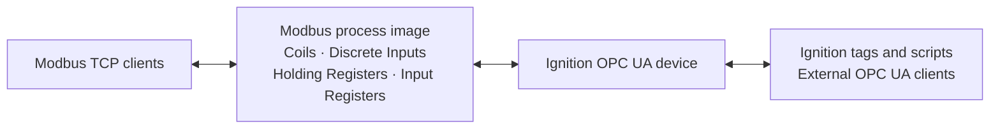

# Modbus Server Driver for Ignition

The Modbus Server Driver adds configurable Modbus TCP server instances to Ignition. Each configured
device has its own listener and in-memory Modbus process image, which can be read and written from
both sides:

- Modbus TCP clients such as PLCs, gateways, test tools, and other masters
- Ignition tags, scripts, and external OPC UA clients through Ignition's OPC UA server

Use it as a bidirectional data exchange area when another system needs to consume data from
Ignition over Modbus, publish data to Ignition over Modbus, or both. The module provides Modbus
server capability; it does not connect to or proxy another Modbus device.

## Capabilities

- All four Modbus data areas: coils, discrete inputs, holding registers, and input registers
- Read/write OPC UA access to every area, including the normally read-only Modbus input areas
- Signed and unsigned integers, floating-point values, strings, register bits, and arrays
- Configurable byte order and word order
- A shared process image or independent images for Modbus unit IDs 0 through 255
- Optional process-image persistence across device and Gateway restarts
- Configurable OPC UA browse ranges without limiting direct address access
- Per-device IPv4 connection allow lists

## Install the module

The 2.x release line is for Ignition 8.3 and requires Ignition's OPC UA module. For Ignition 8.1,
use a 1.x release instead. This README describes the current 2.x behavior.

1. Download `Modbus-Server-Driver-Module-signed.modl` from the
   [GitHub Releases](https://github.com/kevinherron/modbus-server-driver/releases) page.
2. Open module management in the Ignition Gateway web interface and install or upgrade the
   downloaded `.modl` file.
3. Verify that **Modbus Server Driver Module** is running.
4. Open the Gateway's OPC UA device connections and create a **Modbus TCP Server** device.

## Quick start

1. Give the device a name. OPC UA addresses use this name inside square brackets, for example
   `[Modbus Server]HR<int16>0`.
2. Keep **Bind Address** set to `0.0.0.0` and **Port** set to `502`, or choose an interface and port
   appropriate for the Gateway host.
3. Replace the default `*` in **Allowed IP Addresses** with the Modbus clients that should be able
   to connect.
4. For this quick-start check, set **Holding Register Browse Ranges** to `0-9` so the first ten
   holding-register offsets are visible in the OPC browse tree.
5. Save the device and verify that its status is **Listening**.
6. Connect a Modbus TCP client to the Gateway host and configured port. Write a value to holding
   register offset `0`, then browse the device in Ignition and read `HR<int16>0`.

The module uses zero-based Modbus offsets. `HR0` is the first holding register and `C0` is the first
coil. Some Modbus software labels these as `40001` and `00001`; consult the client's addressing
mode when translating those labels to offsets.

**Browsing and Ignition tags are optional.** All 65,536 entries in every process-image area are
available as soon as the device is listening. Browse ranges only choose which addresses are
discoverable in the OPC browse tree, and an Ignition tag only references an address. Neither one
creates, enables, or reserves the underlying Modbus entry.

## How data flows



Each device owns a process image with 65,536 zero-based entries in each Modbus area. Unwritten
entries read as `false` or zero. A write through either protocol is immediately visible through the
other protocol.

| Modbus area | Address prefix | Modbus clients | OPC UA clients | Default OPC UA type |
| --- | --- | --- | --- | --- |
| Coils | `C` | Read and write | Read and write | Boolean |
| Discrete Inputs | `DI` | Read only | Read and write | Boolean |
| Holding Registers | `HR` | Read and write | Read and write | Int16 |
| Input Registers | `IR` | Read only | Read and write | Int16 |

OPC UA access is read/write for all four areas so Ignition can populate discrete inputs and input
registers for Modbus clients to read.

### Register addresses are views

The process image stores raw 16-bit registers. A typed OPC UA address describes how to interpret
one or more of those registers; it does not allocate a separate value.

For example, `HR<int32>0` combines holding registers 0 and 1 into one 32-bit value. The addresses
`HR<int16>0` and `HR<int16>1` view the same underlying bytes as two 16-bit values. Writing through
any of these addresses changes what the others read. Strings, arrays, byte/word-order variants,
and bit selections are overlapping views in the same way.

## Configure a device

The following defaults apply to newly created devices.

| Category | Setting | Default | Purpose |
| --- | --- | --- | --- |
| Connectivity | **Bind Address** | `0.0.0.0` | Local address on which the Modbus TCP listener binds. `0.0.0.0` listens on all IPv4 interfaces. |
| Connectivity | **Port** | `502` | TCP port for Modbus connections; valid values are 1 through 65535. |
| Browsing | **Coil Browse Ranges** | Empty | Coil offsets to show in the OPC browse tree. |
| Browsing | **Discrete Input Browse Ranges** | Empty | Discrete-input offsets to show in the OPC browse tree. |
| Browsing | **Holding Register Browse Ranges** | Empty | Holding-register offsets to show in the OPC browse tree. |
| Browsing | **Input Register Browse Ranges** | Empty | Input-register offsets to show in the OPC browse tree. |
| Browsing | **Unit ID Browse Ranges** | `0` | Unit folders to show when separate per-unit process images are enabled. |
| Process Image | **Persist Data** | Disabled | Retain process-image values across device and Gateway restarts. |
| Process Image | **Separate Per Unit ID** | Disabled | Give each Modbus unit ID an independent process image. |
| Security | **Allowed IP Addresses** | `*` | Remote source addresses allowed to open Modbus TCP connections. |

### Browse ranges

Browse ranges are comma-separated offsets or inclusive ranges, without spaces. For example,
`0-9,100,200-203` exposes offsets 0 through 9, offset 100, and offsets 200 through 203.

Browse ranges control discovery only:

- They do not allocate process-image entries.
- They do not restrict which valid addresses an OPC UA client can use directly.
- An empty range hides that area's values from browsing but does not disable the area.

Coils and discrete inputs appear as Boolean variables. Each browsed holding- or input-register
offset appears as a folder containing `int16`, `uint16`, `int32`, `uint32`, `int64`, `uint64`,
`float`, and `double` views. Enter addresses manually for strings, arrays, bit selections, custom
byte/word order, or any offset not included in a browse range.

## OPC UA address reference

An address is the string identifier beneath the Ignition device node. Ignition prefixes it with the
device name:

```text
[device-name]address
```

For example, the identifier for holding register 0 on a device named `Modbus Server` is:

```text
[Modbus Server]HR<int16>0
```

A general OPC UA client may display the full NodeId, such as
`ns=1;s=[Modbus Server]HR<int16>0`. The namespace index is assigned by the Gateway and is not part
of the driver address syntax.

Build the address after the device-name prefix from these components, in order:

1. Optional unit ID from `0` through `255`, followed by `.`
2. Area: `C`, `DI`, `HR`, or `IR`
3. Optional data type in angle brackets, including any array dimensions and modifiers
4. Zero-based offset from `0` through `65535`
5. Optional zero-based array element indices
6. Optional integer bit selection, preceded by `.`

The driver address portion is case-insensitive and contains no whitespace.

| Address | Meaning |
| --- | --- |
| `C0` | Coil 0 as a Boolean |
| `7.DI12` | Discrete input 12 in unit 7 |
| `HR250` | Holding register 250 using the default `int16` type |
| `HR<uint32>20` | Registers 20 and 21 as an unsigned 32-bit integer |
| `IR<float@LH>100` | Input registers 100 and 101 as a Float with low-high word order |
| `HR<string10>300` | Ten-byte String beginning at holding register 300 |
| `HR<int32>0.5` | Bit 5 of the 32-bit value spanning holding registers 0 and 1 |
| `HR<int16[10]>100` | Ten-element Int16 array beginning at holding register 100 |
| `HR<int16[10]>100[5]` | Element 5 of that array, physically holding register 105 |

### Data types

The data type is optional. Coils and discrete inputs default to `bool`; holding and input registers
default to `int16`. Coil and discrete-input addresses support only `bool`.

| Syntax | OPC UA type | Process-image width |
| --- | --- | --- |
| `bool` | Boolean | One coil/input bit, or one register in a register area |
| `int16` | Int16 | 1 register |
| `uint16` | UInt16 | 1 register |
| `int32` | Int32 | 2 registers |
| `uint32` | UInt32 | 2 registers |
| `int64` | Int64 | 4 registers |
| `uint64` | UInt64 | 4 registers |
| `float` | Float (32-bit) | 2 registers |
| `double` | Double (64-bit) | 4 registers |
| `stringN` | String | `ceil(N / 2)` registers |

`stringN` is a fixed-width UTF-8 string view with a positive byte length `N`. A zero byte
terminates the value when reading. Because UTF-8 characters can use multiple bytes, `N` is not
necessarily the number of characters.

Every address must fit inside its 65,536-entry area. For example, `HR<int32>65535` is invalid
because a 32-bit value requires registers 65535 and 65536.

### Byte order and word order

Add modifiers inside the data-type brackets to match the register layout used by the Modbus
client:

| Modifier | Meaning |
| --- | --- |
| `@BE` | Big-endian byte order; default |
| `@LE` | Little-endian byte order |
| `@HL` | High-low word order; default |
| `@LH` | Low-high word order |

For numeric register values, byte order controls the two bytes within a register and word order
controls the order of the 16-bit registers in a multi-register value. Specify at most one
byte-order modifier and one word-order modifier; they can be combined, as in
`HR<uint32@LE@LH>20`.

### Register bits

Append `.<bit>` to an integer scalar to expose one bit as an OPC UA Boolean. Bit 0 is the least
significant bit. Valid bit indices are 0-15 for 16-bit integers, 0-31 for 32-bit integers, and 0-63
for 64-bit integers.

```text
HR0.7
HR<uint32>10.20
HR<int16[10]>100[3].5
```

Writing a bit changes only that bit in the underlying integer. Bit selection is not supported for
Boolean, floating-point, String, or whole-array values.

## Arrays

Declare one to three positive dimensions after the data type and before any byte/word-order
modifiers:

```text
HR<int16[10]>0
HR<int32[5][2]@LE>100
C<bool[2][2]>20
```

An address without element indices represents the whole array. One-dimensional values are OPC UA
arrays; two- and three-dimensional values are OPC UA matrices with matching `ValueRank` and
`ArrayDimensions` metadata.

Append one zero-based index for every declared dimension to address a scalar element:

```text
HR<int16[10]>0[5]
HR<int32[5][2]>100[2][1]
```

Arrays use row-major order, so the last index changes fastest. In the second example, element
`[2][1]` has linear index `2 * 2 + 1 = 5`. Each `int32` uses two registers, so the element begins at
physical offset `100 + 5 * 2 = 110`.

The complete array extent must fit in its Modbus area:

```text
HR<int16[36]>65500    valid: ends at the area boundary
HR<int16[37]>65500    invalid: extends past the area boundary
```

### OPC UA IndexRange

OPC UA clients can use the standard `IndexRange` field to read or write part of an array node:

- `2:5` selects elements 2 through 5 of a one-dimensional array.
- `1:2,0:1` selects rows 1 through 2 and columns 0 through 1 of a two-dimensional array.

`IndexRange` is request metadata, not part of the address. For example,
`HR<int16[10]>0[2:5]` is not a valid address; use `HR<int16[10]>0` and send `2:5` in the request's
`IndexRange` field.

For String values, `IndexRange` selects characters as defined by OPC UA. On a String array, an
additional final range dimension selects characters within the selected elements.

## Unit IDs and process images

### Unified process image

By default, all Modbus unit IDs share one process image. Unit IDs affect the Modbus request but not
which data is accessed. On the OPC UA side, all of these addresses are aliases:

```text
HR0
0.HR0
7.HR0
255.HR0
```

Use this mode when unit ID is irrelevant or when every client should exchange data through the same
image.

### Separate process image per unit ID

Enable **Separate Per Unit ID** when unit IDs must hold independent data. In this mode, `7.HR0`
addresses holding register 0 for unit 7, while `8.HR0` addresses different storage for unit 8. An
address without a unit ID selects unit 0, so `HR0` and `0.HR0` remain aliases.

All unit IDs from 0 through 255 are directly accessible. **Unit ID Browse Ranges** only chooses
which `Unit N` folders appear in the OPC browse tree. It accepts comma-separated IDs and inclusive
ranges such as `0,2,10-15`; an empty value displays no unit folders.

### Persistence

With **Persist Data** disabled, the process image is held in memory and starts with zero/false
values after a device or Gateway restart. Enable it to restore the last persisted values when the
device starts again.

Unified and separate-per-unit modes use independent persisted datasets. Changing modes does not
copy or delete values. If you change back, the module restores the data last persisted in that
mode.

## Restrict Modbus TCP connections

**Allowed IP Addresses** is a comma-separated allow list checked against the remote source address
when a TCP connection is accepted. The default `*` permits every source address.

| Entry form | Example | Meaning |
| --- | --- | --- |
| Any address | `*` | Disable source-address filtering |
| IPv4 literal | `192.168.1.50` | One address |
| IPv4 CIDR block | `192.168.1.0/24` | Addresses `192.168.1.0` through `192.168.1.255` |
| Trailing wildcard | `192.168.1.*`, `192.168.*`, `10.*` | A whole-octet IPv4 block |
| Short range | `192.168.1.10-20` | Last octets 10 through 20, inclusive |
| Full range | `192.168.1.10-192.168.2.5` | An inclusive IPv4 address interval |

A source is allowed when it matches any entry. Whitespace around comma-separated entries is
ignored; whitespace inside an entry and empty entries are invalid. CIDR entries must use the
network address with host bits set to zero. Lists are limited to 256 entries and 4,096 characters.
The field cannot be blank; use `*` when source-address filtering is intentionally disabled.

DNS names, IPv6 addresses, regular expressions, deny rules, and leading-zero IPv4 octets are not
supported. A restrictive list rejects IPv6 connections; `*` is the only rule that disables the
filter for both address families.

The allow list complements **Bind Address**. Bind Address chooses the local interfaces that accept
connections; the allow list chooses permitted remote IPv4 sources. The check sees the source
address presented to the Gateway, so clients behind NAT, a proxy, or a container bridge may appear
under a shared address.

This setting protects the Modbus TCP listener only. Secure OPC UA access separately using
Ignition's endpoint, authentication, role, and certificate settings. Saving a changed device
configuration restarts the listener, closes its current connections, and applies the new list.

Release-specific changes and upgrade notes belong on the
[GitHub Releases](https://github.com/kevinherron/modbus-server-driver/releases) page.
